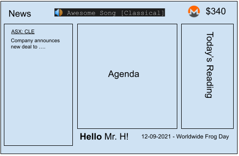

# Daily Dashboard

## Learning Objectives

- Be able to create a simple CGI web application.
    - concept of internet protocols, including: HTTP
    - types of communication software, including: browser, email, web authoring, scripting
    - use web tools to create linked web pages
- Undestand how web technologies such as HTTP, HTML and CSS interact.

## Background

Let's build a daily dashboard 'app' using Python, HTTP and Web Technologies. The idea is we can set our browsers homepage to be our daily dashboard and see it whenever we open up our browser. The best part is that WE are in control of what content is shown in our dashboard because it is OUR software! No ads or pushed agendas, we see whatever we want to see - this is how using a computer is meant to be!

## Technologies

- Hyper Text Transfer Protocol (HTTP)
- Hyper Text Markup Language (HTML)
- Cascading Style Sheets (CSS)
- JavaScript (JS)
- Python
- Common Gateway Interface (CGI)
- Templating (Python Mako Templates)

## Tutorials

- ~~Static Webpages~~
- Displaying a random quote
- Using CSS grid for layout
- Embedding a guessing game
- Simplifying CGI scripts with Mako Templates
- Display Emails
- RSS News Feed

## Ideas

- Resist subliminal messaging by choosing your own wallpapers for your dashboard. Download a bunch and place them in a folder and then use python to choose a random one each time you load the dashboard.
- Don't be a music renter, buy some songs and save them on your own device - you can then choose a song of the day and play it when you load your dashboard - awesome!
- Enable IMAP access from gmail and then use Python's IMAP libray (https://docs.python.org/3/library/imaplib.html) to grab any emails from today.
- Only two weeks left of school, let's celebrate with a days-of-school-left countdown in the corner of our homepage!
- Create a text file of inspirational quotes, then use python to read it and choose a random one to display! 
- Show news articles from the ABC https://www.abc.net.au/news/feed/4570996/rss.xml in your dashboard using RSS, be in control of the news you want to see!
- Display the current price of your favourite crypto - you could even go all out and generate an SVG chart!
- Integrate google calendar (https://developers.google.com/calendar/api/quickstart/python) to display any upcoming events you have today.